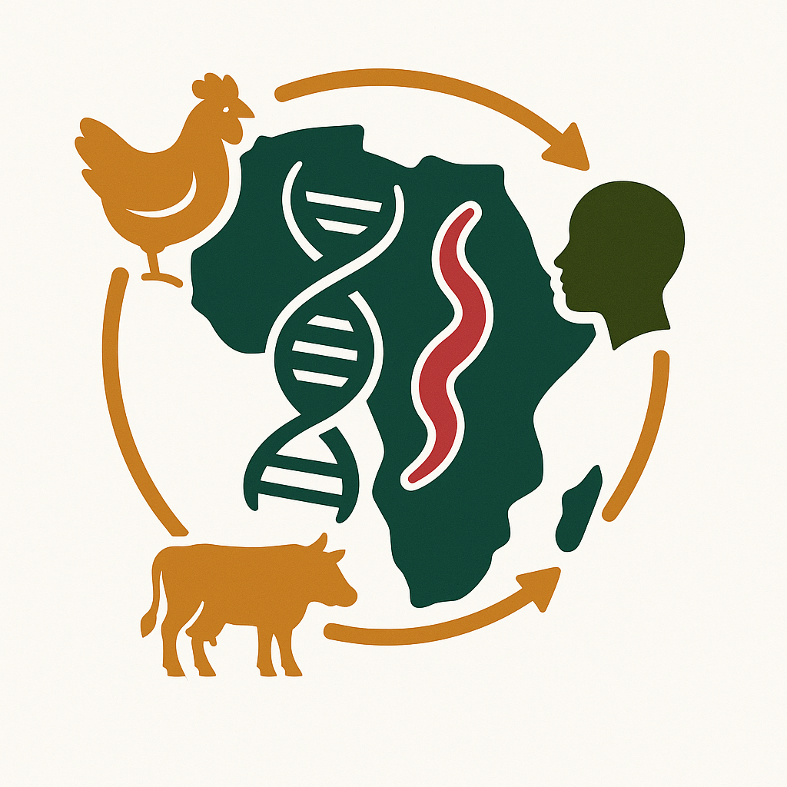

# Campylobacter Control Campaign (CCC)

  

## Kick-off Workshop 
MRC Unit, The Gambia at the London School of Hygeine and Tropical Medicine

Fajara, the Gambia

**10–16 March 2026**

---

## Participants (In Person)

### Oxford
- Samuel Sheppard  
- Ben Pascoe  
- Frances Colles  
- Ahmed Aboushady  
- Andrew Farlow  

**Note:** Fran will depart on **13 March**.

### LSHTM
- Brendan Wren  
- Ozan Gundogdu
 
**Note:** Ozan will depart on **13 March**.

### MRC Gambia
- Umberto D’Alessandro  
- Jahangir Hossain  
- Abdul Sesay  
- Henry Badji (+ coordination team)  
- Benoit  
- Mehrab  

### Swansea
- Matthew Hitchings  

### Côte d’Ivoire
- Kanny Diallo  
- Firmin Missa  

**Note:** Kanny and Firmin will arrive on **xx March** and depart on **xx March**.

### Nigeria
- Stella Smith  
- Utibeima Udo Essiet  

**Note:** Stella Smith and Utibeima Udo Essiet will arrive on **9 March** and depart on **16 March**.

---

## Workshop Objectives

- Finalise harmonised multi-country sampling framework  
- Align culture-dependent and metagenomic strategies  
- Define genomic outputs required for vaccine design  
- Clarify data governance (REDCap, EpiCollect, metadata harmonisation)  
- Agree initial PhD project themes and supervision structure  
- Define governance split (Core vs Scientific meetings)

---

## Expected Outcomes

- Agreed sampling numbers and site distribution  
- Defined data flow: field → lab → sequencing → analysis  
- Vaccine-relevant genomic deliverables list  
- REDCap database architecture confirmed  
- Central protocol structure agreed  
- Clear 6-month action plan with named leads

---

# Workshop Agenda
*All talks are 15 minutes + 5 minutes discussion unless otherwise stated*

---

## Day 1 – Tuesday 10 March  
**Arrival – Banjul**

| Time | Activity | Lead | Location | Notes |
|------|----------|------|----------|-------|
| All day | Arrivals & hotel check-in | — | Ocean Bay / local | — |
| Evening | Informal recovery & catch-ups | — | Ocean Bay | Dinner not included |

---

## Day 2 – Wednesday 11 March  
**Programme Overview, Science Talks & Sampling Exercise**  
**Location: MRC Fajara**

| Time | Activity | Lead | Notes |
|------|----------|------|-------|
| 09:00 | Coffee & arrival | — | — |
| 09:30 | Host welcome | Umberto / Jahangir | Welcome to MRC |
| 09:45 | CCC programme overview | Sam | Objectives & framing |
| 10:00 | Week overview (5 min) | Ben | Structure & expected outputs |
| 10:05 | Sampling methods & outcomes from GETCampy | Fran | Transmission insights |
| 10:20 | Gambia infrastructure & feasibility | Jahangir | Operational context |
| 10:35 | **Coffee break** | — | — |
| 11:00 | Building economic and cost effectiveness frameworks to support good local decision making | Andrew | Policy & economic context |
| 11:15 | Côte d’Ivoire sampling plans | Kanny | Sampling overview |
| 11:30 | Firmin Missa – Field implementation & student perspective (Côte d’Ivoire) | Firmin | On-the-ground sampling |
| 11:45 | Utibeima Udo Essiet – Student research focus (Nigeria) | Uti | Study objectives || 12:15 | Lunch | — | Provided by MRC |
| 12:00 | Nigeria sampling plans | Stella | Sampling overview |
| 13:00 | **Lunch** | — | Provided by MRC |
| 14:00 | *Prayer* | — | — |  
| 14:30 | Implementation considerations | Henry Badji | Operational |
| 14:45 | Maximising value from collected samples | Matt | Sequencing strategy |
| 15:00 | Sampling aims & estimates (incl. EpiCollect demo) | Ben | "How many?" |
| 15:15 | Practical sampling exercise | Ben / Henry / Fran | Swabbing & metadata capture |
| 16:45 | **Close** | — | — |
| Evening | Group welcome dinner (Included) | — | Calypso Bar (Table for 17-20?) | Grant-funded |

---

## Day 3 – Thursday 12 March  
**Basse Site Visit**

| Time | Activity | Lead | Notes |
|------|----------|------|-------|
| 05:30 | Travel to Basse | — | All listed participants |
| 12:00 | **Lunch at the MRC, Basse** | — | — | 
| Afternoon | 3 visits to Northern River Region : 
| | 1. Vet office | | 
| | 2. clinic | | 
| | 3. village | | 
| Evening | Dinner at Basse site | — | Confirm locally |

---

## Day 4 – Friday 13 March  
**Vaccines, Genomics & Integration – MRC Fajara**

| Time | Activity | Lead | Notes |
|------|----------|------|-------|
| 05:30 | Travel to Fajara | — | — |
| 12:00 | MRC seminar: *What can genotyping studies tell us about the transmission of Campylobacter from farm to fork?* | Fran | Fixed time |
| 13:00 | **Lunch** | — | Provided by MRC |
| 14:00 | *Prayer* | — | — |
| 14:30 | Check on cultures from sampling exercise | — | lab check |
| 15:30 | **Coffee break** | — | — |
| 16:00 | Local sequencing capacity & opportunities | Benoit | Local lab processes |
| 16:15 | Long read sequencing and local capacity builing for Nigeria and Cote d'Ivoire | Abdul | Infrastructure |
| 16:30 | REDCap databases & data governance | Mehrab | Data management |
| 16:45 | Source attribution | Ben | Genome analysis | 
| 17:00 | Vaccine strategy & genomic requirements | Brendan | Vaccine perspective |
| 17:15 | Antigen priorities & strain considerations | Ozan | Vaccine targets |
| 17:30 | Programme integration & decisions (30 min) | Sam (Chair) |  
| | - Sampling numbers confirmed? | |
| | - Data flow agreed? | | 
| | - Vaccine deliverables clarified? | | 
| | - Protocol timeline agreed? | |  
| | - Named leads for next steps | | 
| Evening | Departures | Fran & Ozan |

---

## Day 5 – Saturday 14 March  
**Informal / Optional**

| Time | Activity | Notes |
|------|----------|-------|
| Flexible | Optional boat trip | Not included |

---

## Day 6 – Sunday 15 March  
**Optional Cultural Visit / Departures**

| Time | Activity | Notes |
|------|----------|-------|
| Morning | Optional visit to Kachikally Crocodile Park | Informal |
| — | Departures | Kanny & Stella |

---

## Day 7 – Monday 16 March  
**Discussion Buffer & Departures**

| Time | Activity | Notes |
|------|----------|-------|
| Daytime | Optional follow-up discussions | -- |
| Evening | Departures | Late flights |

---

# Key Scientific Themes

- Harmonised multi-country sampling (Gambia, Nigeria, Côte d’Ivoire)
- Culture-dependent and independent approaches
- Metagenomics and MAG recovery
- Source attribution framework
- Genomics-informed vaccine design
- Capacity building and local sequencing

---

# AoB
 
- Wastewater sampling 
- Expanded chicken sampling
- Henry PhD catchup
- CCC PhD programme / cohort (including integration with other graduate studnet programmes, e.g. LSHTM, Swansea Univesity GEMS, OxAfrica, IOI)
